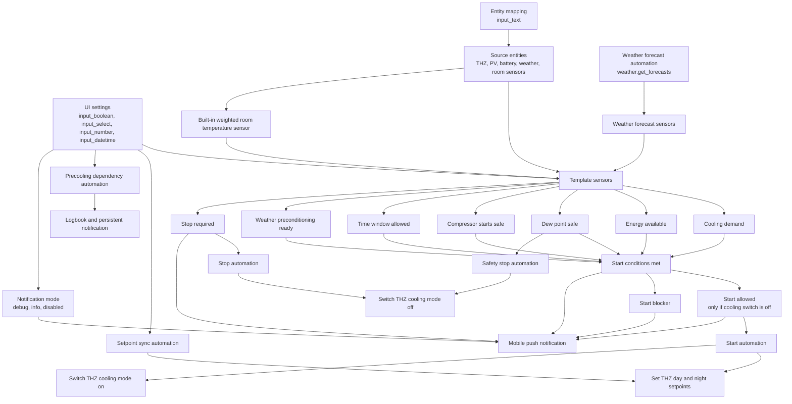

# THZ504 Dynamic Cooling Control for Home Assistant

**Version:** 0.6.9  
**Ziel:** PV-, Wetter-, Komfort- und Zeitprofil-optimierte Kühlfreigabe für Tecalor THZ504 / bauähnliche THZ-Anlagen mit Flächenkühlung über Fußbodenheizung.

Dieses Home-Assistant-Package steuert nicht den Verdichter, die interne Vorlaufregelung oder die Taupunktlogik der THZ direkt. Es setzt die **Kühlfreigabe**, synchronisiert die **Tag-/Nacht-Zieltemperaturen** zur THZ und entscheidet anhand von Raumtemperatur, PV-Überschuss, Batterie, Wetterprognose, Taupunkt, Feuchte und Verdichterstarts, wann Kühlung sinnvoll und sicher ist.

Die THZ-interne Regelung bleibt maßgeblich für:

- Verdichterbetrieb
- Vorlauf-/Rücklaufregelung
- Pumpen und Ventile
- interne Kühlhysterese
- Taupunktschutz

> Hinweis zur Migration auf v0.6.9: Der gewichtete Temperatur-Sensor ist jetzt Bestandteil des Packages. Falls der Sensor bisher in `template.yaml` definiert war, sollte diese alte Definition entfernt werden, damit keine doppelte Entity entsteht.

---

## Funktionsumfang

Die aktuelle Version kann:

- Kühlung dynamisch freigeben oder sperren.
- Tag- und Nachtbetrieb über UI-Zeiten steuern.
- Tag- und Nacht-Zieltemperaturen per UI ändern und live zur THZ synchronisieren.
- Einen integrierten gewichteten Temperatur-Sensor bereitstellen.
- Wochentage und Wochenende in der Raumgewichtung berücksichtigen.
- Das Schlafzimmer zeit- und temperaturabhängig priorisieren.
- Büro und Gästezimmer montags bis freitags während Homeoffice-Zeiten stärker berücksichtigen.
- Büro und Gästezimmer am Wochenende ganztägig niedrig gewichten.
- Wohnzimmer am Wochenende zwischen 08:00 und 21:00 stärker gewichten.
- PV-Überschuss, Netzeinspeisung, Netzbezug, Batterie-SOC, Akku-Ladeleistung und Akku-Entladeleistung bewerten.
- PV-Prognosen, insbesondere `next hour` und `today`, in die Kühlentscheidung einbeziehen.
- Wetterprognosen über `weather.get_forecasts` auswerten.
- Wetterbasierte Vorkühlung bei heißen Folgetagen aktivieren.
- PV-Precooling und Weather-Precooling getrennt schalten.
- Weather-Precooling automatisch deaktivieren, wenn PV-Precooling deaktiviert wird.
- Taupunkt- und Luftfeuchtebedingungen prüfen.
- Vorlauf-/Rücklauf-Spreizung zur Diagnose echter Kälteabnahme anzeigen.
- Verdichterstarts pro Tag begrenzen.
- Mindestlaufzeit und Sperrzeit nach Abschaltung erzwingen.
- Startbedingungen, Startfreigabe, Startblocker und Control-Reason transparent anzeigen.
- Push-Modus über UI wählen: `debug`, `info` oder `disabled`.
- Alle installationsspezifischen Entity-IDs zentral über `input_text`-Helper mappen.

---

## Architektur



---

## Entscheidungslogik

Ein Kühlstart ist nur möglich, wenn:

```text
Automation Enabled = on
Sensor Data Valid = on
Cooling Demand = on
ODER Weather Preconditioning Ready = on
Energy Available = on
Dew Point Safe = on
Compressor Starts Safe = on
Time Window Allowed = on
Lockout Timer = idle
Cooling Mode Switch = off
```

Daraus entstehen zwei getrennte Diagnosezustände:

- **Start Conditions Met**: Alle fachlichen Bedingungen sind erfüllt.
- **Start Allowed**: Alle fachlichen Bedingungen sind erfüllt und die Kühlung ist aktuell aus.

Wenn die Kühlung bereits aktiv ist, kann `Start Conditions Met = on` sein, während `Start Allowed = off` ist. In diesem Fall lautet der Startblocker typischerweise `cooling_already_on`.

---

## Integrierter gewichteter Temperatur-Sensor

Der Sensor `sensor.temperatur_haus_kuehlung_gewichtung` bzw. je nach Entity-ID-Generierung `sensor.temperatur_haus_kuhlung_gewichtung` ist jetzt Bestandteil des Packages.

Er verwendet folgende Raum-Entitäten aus dem Mapping:

| Mapping-Helper | Bedeutung |
|---|---|
| `input_text.thz504_entity_room_living_temperature` | Wohnzimmer |
| `input_text.thz504_entity_room_bedroom_temperature` | Schlafzimmer |
| `input_text.thz504_entity_room_office_temperature` | Büro |
| `input_text.thz504_entity_room_kitchen_temperature` | Küche |
| `input_text.thz504_entity_room_guest_temperature` | Gast / zweites Büro |
| `input_text.thz504_entity_room_dressing_temperature` | Ankleide |

Ungültige Raum-Sensoren werden ignoriert, statt mit `0 °C` in den Mittelwert einzugehen.

### Gewichtung Montag bis Freitag

| Zeitraum | Logik |
|---|---|
| 06:00–14:00 | Büro und Gast werden zusätzlich verstärkt. |
| 14:00–21:00 | Wohnzimmer und Küche werden zusätzlich verstärkt. |
| 18:00–06:00 | Schlafzimmer wird verstärkt. |
| 21:00–06:00 | Schlafzimmer wird zusätzlich dominant gewichtet. |

### Gewichtung Samstag und Sonntag

| Zeitraum | Logik |
|---|---|
| ganztägig | Büro und Gast haben nur Priorität 1. |
| 08:00–21:00 | Wohnzimmer wird mit Priorität 4 gewichtet. |
| 18:00–06:00 | Schlafzimmer wird wie an Wochentagen verstärkt. |
| 21:00–06:00 | Schlafzimmer wird zusätzlich dominant gewichtet. |

### Temperaturabhängiger Schlafzimmer-Bonus

| Schlafzimmer-Temperatur | Zusatzgewicht |
|---:|---:|
| ≥ 22.0 °C | +2 |
| ≥ 23.0 °C | +4 |

---

## Wetterlogik

Das Package ruft stündlich `weather.get_forecasts` mit `type: daily` auf und erzeugt daraus eigene Forecast-Sensoren.

Die Wetterlogik nutzt:

- heutige Maximaltemperatur
- morgige Maximaltemperatur
- höchste Maximaltemperatur der nächsten drei Tage
- maximale Niederschlagswahrscheinlichkeit der nächsten drei Tage
- Condition heute
- Condition morgen

`Weather Cooling Pressure` wird aktiv, wenn heiße Prognosen vorliegen und die Regenwahrscheinlichkeit nicht zu hoch ist.

`Weather Preconditioning Ready` ist strenger und gilt nur, wenn zusätzlich:

- Weather-Precooling eingeschaltet ist,
- PV-Precooling eingeschaltet ist,
- Daytime aktiv ist,
- Wetterdruck aktiv ist,
- die gewichtete Raumtemperatur bereits leicht oberhalb des Zielbereichs liegt.

---

## PV- und Energie-Logik

`Cooling Energy Available` wird aktiv, wenn mindestens einer der Energiepfade erfüllt ist:

- ausreichender effektiver PV-Überschuss
- ausreichende Netzeinspeisung
- gute PV-Prognose
- Wetter-Vorkühlung mit PV-Prognose
- Batterie ausreichend voll
- Batterie lädt
- PV wird abgeregelt
- Komfort-Override aktiv

Dadurch ist die Kühlung bevorzugt PV-gedeckt, aber bei zu hoher Raumtemperatur nicht vollständig blockiert.

---

## Taupunkt- und Feuchteschutz

`Cooling Dew Point Safe` prüft:

- mittlere Innenluftfeuchte
- THZ-Taupunkt
- THZ-Vorlauftemperatur
- Verdichterstatus
- Tag-/Nacht-Grenzwerte
- Sicherheitsabstand Vorlauf zu Taupunkt

Wenn der Verdichter läuft, muss die Vorlauftemperatur mindestens um den konfigurierten Sicherheitsabstand über dem Taupunkt liegen.

---

## Benachrichtigungen

Ab v0.6.9 wird das Push-Verhalten über `input_select.thz504_cooling_notification_mode` gesteuert.

| Modus | Wirkung |
|---|---|
| `debug` | Debounced Push bei High-Level-Statusänderungen: Start Allowed, Conditions Met, Start Blocker, Stop Required, Control Reason. |
| `info` | Push nur, wenn die Automation die Kühlung tatsächlich ein- oder ausschaltet. |
| `disabled` | Keine mobilen Pushnachrichten. Logbook und Persistent Notifications für interne Hinweise bleiben möglich. |

---

# Sensoren

## Wetter-Sensoren

| Entity | Typ | Mögliche States | Bedeutung |
|---|---|---|---|
| `sensor.thz504_weather_forecast_today_temperature` | Sensor | Zahl in °C, fallback `0` | Tageshöchsttemperatur heute aus `weather.get_forecasts`. |
| `sensor.thz504_weather_forecast_tomorrow_temperature` | Sensor | Zahl in °C, fallback `0` | Tageshöchsttemperatur morgen. |
| `sensor.thz504_weather_forecast_max_temperature_next_3_days` | Sensor | Zahl in °C, fallback `0` | Höchste prognostizierte Temperatur der nächsten drei Tage. |
| `sensor.thz504_weather_forecast_max_precip_probability_next_3_days` | Sensor | Zahl in %, fallback `0` | Höchste Niederschlagswahrscheinlichkeit der nächsten drei Tage. |
| `sensor.thz504_weather_forecast_today_condition` | Sensor | HA weather condition string, z. B. `sunny`, `partlycloudy`, `rainy`, `unknown` | Wetterzustand heute. |
| `sensor.thz504_weather_forecast_tomorrow_condition` | Sensor | HA weather condition string, z. B. `sunny`, `partlycloudy`, `rainy`, `unknown` | Wetterzustand morgen. |
| `binary_sensor.thz504_weather_cooling_pressure` | Binary Sensor | `on`, `off` | `on`, wenn Wetterprognose Kühl-/Vorkühldruck erzeugt. |
| `binary_sensor.thz504_cooling_weather_preconditioning_ready` | Binary Sensor | `on`, `off` | `on`, wenn wetterbasierte Vorkühlung tatsächlich als Startgrund zulässig ist. |

## Raumtemperatur- und Diagnose-Sensoren

| Entity | Typ | Mögliche States | Bedeutung |
|---|---|---|---|
| `sensor.temperatur_haus_kuhlung_gewichtung` | Sensor | Zahl in °C oder `unavailable` | Dynamisch gewichtete Führungs-Raumtemperatur für Kühlung. |
| `sensor.thz504_cooling_net_grid_surplus` | Sensor | Zahl in W | Netzeinspeisung minus Netzbezug. Positive Werte bedeuten Netto-Überschuss. |
| `sensor.thz504_cooling_effective_pv_surplus` | Sensor | Zahl in W | Effektiver PV-Überschuss aus PV-Überschuss und Netzbilanz. |
| `sensor.thz504_cooling_return_flow_delta` | Sensor | Zahl in K | Rücklauf minus Vorlauf. Im Kühlbetrieb sollte dieser Wert positiv sein. |
| `sensor.thz504_cooling_active_setpoint` | Sensor | Zahl in °C | Aktuell gültiger Tag- oder Nacht-Sollwert. |
| `sensor.thz504_cooling_dynamic_start_temperature` | Sensor | Zahl in °C | Tatsächlich verwendete Starttemperatur, ggf. um Wetter-Precooling-Offset abgesenkt. |
| `sensor.thz504_cooling_score` | Sensor | `0` bis `100` | Diagnosewert für Kühlpriorität. Er startet nicht direkt die Kühlung. |
| `sensor.thz504_cooling_control_reason` | Sensor | Status-String | Hauptstatus der Regelung. |
| `sensor.thz504_cooling_start_blocker` | Sensor | `none` oder kommaseparierte Blocker | Zeigt, warum ein Start aktuell nicht erlaubt ist. |

## Entscheidungs-Binary-Sensoren

| Entity | Mögliche States | Bedeutung |
|---|---|---|
| `binary_sensor.thz504_cooling_daytime` | `on`, `off` | `on`, wenn aktuelle Uhrzeit im konfigurierten Tagfenster liegt. |
| `binary_sensor.thz504_cooling_sensor_data_valid` | `on`, `off` | `on`, wenn alle gemappten Pflichtentitäten gültige Werte liefern. |
| `binary_sensor.thz504_cooling_demand` | `on`, `off` | `on`, wenn normaler Kühlbedarf anhand gewichteter oder mittlerer Raumtemperatur besteht. |
| `binary_sensor.thz504_cooling_comfort_override` | `on`, `off` | `on`, wenn die Komfort-Override-Temperatur überschritten ist. |
| `binary_sensor.thz504_cooling_energy_available` | `on`, `off` | `on`, wenn mindestens ein Energiepfad für Kühlung erfüllt ist. |
| `binary_sensor.thz504_cooling_dew_point_safe` | `on`, `off` | `on`, wenn Taupunkt, Feuchte und Vorlaufabstand sicher sind. |
| `binary_sensor.thz504_cooling_compressor_starts_safe` | `on`, `off` | `on`, wenn Verdichterstarts heute unter dem Limit liegen. |
| `binary_sensor.thz504_cooling_time_window_allowed` | `on`, `off` | `on`, wenn Tagzeit ist oder Nachtkühlung erlaubt ist. |
| `binary_sensor.thz504_cooling_effective_heat_extraction` | `on`, `off` | `on` nur wenn Kühlung aktiv ist, der Verdichter läuft und Rücklauf minus Vorlauf mindestens dem Mindestdelta entspricht. |
| `binary_sensor.thz504_cooling_start_conditions_met` | `on`, `off` | `on`, wenn alle fachlichen Startbedingungen erfüllt sind. |
| `binary_sensor.thz504_cooling_start_allowed` | `on`, `off` | `on`, wenn Startbedingungen erfüllt sind und der THZ-Kühlmodus aktuell aus ist. |
| `binary_sensor.thz504_cooling_stop_required` | `on`, `off` | `on`, solange mindestens eine Stoppbedingung vorliegt. |

---

# Einstellmöglichkeiten

## Entity-Mapping (`input_text`)

| Helper | Bedeutung | Beispiel |
|---|---|---|
| `input_text.thz504_entity_indoor_temp_average` | Mittlere Raumtemperatur als Plausibilitäts- und Sekundärsignal. | `sensor.temperatur_haus_mittel_alle` |
| `input_text.thz504_entity_indoor_temp_weighted` | Primäre gewichtete Führungsgröße für Kühlung. | `sensor.temperatur_haus_kuhlung_gewichtung` |
| `input_text.thz504_entity_room_living_temperature` | Wohnzimmer-Sensor für integrierte Gewichtung. | `sensor.eltako_gw1_05_91_dd_e4_temperature` |
| `input_text.thz504_entity_room_bedroom_temperature` | Schlafzimmer-Sensor für integrierte Gewichtung. | `sensor.eltako_gw1_05_91_df_e0_temperature` |
| `input_text.thz504_entity_room_office_temperature` | Büro-Sensor für integrierte Gewichtung. | `sensor.eltako_gw1_05_96_20_c7_temperature` |
| `input_text.thz504_entity_room_kitchen_temperature` | Küchen-Sensor für integrierte Gewichtung. | `sensor.eltako_gw1_05_93_c2_32_temperature` |
| `input_text.thz504_entity_room_guest_temperature` | Gast-/zweites-Büro-Sensor für integrierte Gewichtung. | `sensor.eltako_gw1_05_96_2a_9f_temperature` |
| `input_text.thz504_entity_room_dressing_temperature` | Ankleide-Sensor für integrierte Gewichtung. | `sensor.eltako_gw1_05_91_dd_cb_temperature` |
| `input_text.thz504_entity_indoor_humidity_average` | Mittlere Innenfeuchte für Taupunkt-/Feuchteprüfung. | `sensor.luftfeuchtigkeit_haus_mittel` |
| `input_text.thz504_entity_outdoor_temp` | Außentemperatur für Score und Plausibilität. | `sensor.temperatur_aussen_mittel` |
| `input_text.thz504_entity_weather` | Wetter-Entity für `weather.get_forecasts`. | `weather.ieppel31` |
| `input_text.thz504_entity_pv_generation` | Aktuelle PV-Erzeugung in W. | `sensor.senec_pv_erzeugung` |
| `input_text.thz504_entity_pv_direct_consumption` | PV-Direktverbrauch in W; Validitäts-/Diagnosesignal. | `sensor.senec_pv_direktverbrauch` |
| `input_text.thz504_entity_pv_surplus` | PV-Überschuss in W. | `sensor.pv_ueberschuss` |
| `input_text.thz504_entity_pv_curtailment` | PV-Begrenzung in %. Werte unter 100 zeigen Abregelung. | `sensor.senec_pv_begrenzung` |
| `input_text.thz504_entity_grid_import` | Netzbezug in W. | `sensor.senec_netz_bezug` |
| `input_text.thz504_entity_grid_export` | Netzeinspeisung in W. | `sensor.senec_netz_einspeisung` |
| `input_text.thz504_entity_battery_soc` | Batterie-SOC in %. | `sensor.senec_akku_ladestand` |
| `input_text.thz504_entity_battery_charge` | Akku-Ladeleistung in W. | `sensor.senec_akku_laden` |
| `input_text.thz504_entity_battery_discharge` | Akku-Entladeleistung in W. | `sensor.senec_akku_entladen` |
| `input_text.thz504_entity_pv_forecast_next_hour` | PV-Prognose nächste Stunde in Wh. | `sensor.solcast_pv_forecast_forecast_next_hour` |
| `input_text.thz504_entity_pv_forecast_today` | PV-Prognose heute in Wh. | `sensor.solcast_pv_forecast_forecast_today` |
| `input_text.thz504_entity_pv_forecast_tomorrow` | PV-Prognose morgen in Wh. | `sensor.solcast_pv_forecast_forecast_tomorrow` |
| `input_text.thz504_entity_cooling_mode_switch` | THZ-Kühlmodus-Schalter. | `switch.esp32_thz_controller_kuehlmode` |
| `input_text.thz504_entity_compressor` | Verdichterstatus. | `binary_sensor.esp32_thz_controller_verdichter` |
| `input_text.thz504_entity_compressor_starts_today` | Verdichterstarts heute. | `sensor.esp32_thz_controller_starts_tag` |
| `input_text.thz504_entity_compressor_runtime_current` | Aktuelle Verdichterlaufzeit. | `sensor.thz_verdichter_laufzeit_aktuell` |
| `input_text.thz504_entity_flow_temperature` | THZ-Vorlauftemperatur. | `sensor.esp32_thz_controller_vorlaufisttemp` |
| `input_text.thz504_entity_return_temperature` | THZ-Rücklauftemperatur. | `sensor.esp32_thz_controller_ruecklaufisttemp` |
| `input_text.thz504_entity_dewpoint` | THZ-Taupunkt. | `sensor.esp32_thz_controller_taupunkt_hk1` |
| `input_text.thz504_entity_climate_day` | THZ-Climate-Entity für Tag-Zieltemperatur. | `climate.esp32_thz_controller_heating_day` |
| `input_text.thz504_entity_climate_night` | THZ-Climate-Entity für Nacht-Zieltemperatur. | `climate.esp32_thz_controller_heating_night` |
| `input_text.thz504_entity_notify_service` | Notify-Service für Pushmeldungen. | `notify.mobile_app_op13` |

## Schalter (`input_boolean`)

| Helper | States | Wirkung |
|---|---|---|
| `input_boolean.thz504_cooling_automation_enabled` | `on`, `off` | Hauptschalter. `off` blockiert alle automatischen Starts. |
| `input_boolean.thz504_cooling_allow_night` | `on`, `off` | `on` erlaubt Kühlung außerhalb des Tagfensters. `off` blockiert Nachtkühlung. |
| `input_boolean.thz504_cooling_pv_preconditioning_enabled` | `on`, `off` | `on` erlaubt PV-basierte Vorkühlung. `off` deaktiviert PV-Precooling und schaltet per Dependency-Automation auch Weather-Precooling aus. |
| `input_boolean.thz504_cooling_weather_preconditioning_enabled` | `on`, `off` | `on` erlaubt wetterbasierte Vorkühlung, aber nur wenn PV-Precooling ebenfalls aktiv ist. |

## Dropdown (`input_select`)

| Helper | Optionen | Wirkung |
|---|---|---|
| `input_select.thz504_cooling_notification_mode` | `debug`, `info`, `disabled` | Steuert mobile Pushmeldungen. `debug` meldet stabilisierte High-Level-Zustände, `info` nur tatsächliches Schalten durch die Automation, `disabled` keine Pushmeldungen. |

## Zeitfenster (`input_datetime`)

| Helper | Empfohlener Wert | Bedeutung |
|---|---:|---|
| `input_datetime.thz504_cooling_day_start_time` | `06:00:00` | Beginn Taglogik. |
| `input_datetime.thz504_cooling_day_end_time` | `21:00:00` | Ende Taglogik. |

## Temperatur-Einstellungen (`input_number`)

| Helper | Empfohlen | Bedeutung |
|---|---:|---|
| `input_number.thz504_cooling_day_start_temp` | `23.2 °C` | Normale Starttemperatur tagsüber. |
| `input_number.thz504_cooling_day_stop_temp` | `22.0 °C` | Ziel-/Stopptemperatur tagsüber. |
| `input_number.thz504_cooling_night_start_temp` | `23.8 °C` | Starttemperatur nachts. |
| `input_number.thz504_cooling_night_stop_temp` | `22.8 °C` | Ziel-/Stopptemperatur nachts. |
| `input_number.thz504_cooling_comfort_override_temp` | `24.8 °C` | Ab dieser Temperatur darf Komfort PV-/Batterieoptimierung übersteuern. |
| `input_number.thz504_cooling_day_setpoint` | `22.0 °C` | Solltemperatur, die an die THZ-Tag-Climate-Entity gesendet wird. |
| `input_number.thz504_cooling_night_setpoint` | `22.8 °C` | Solltemperatur, die an die THZ-Nacht-Climate-Entity gesendet wird. |

## PV-, Batterie- und Netz-Einstellungen (`input_number`)

| Helper | Empfohlen | Bedeutung |
|---|---:|---|
| `input_number.thz504_cooling_min_pv_surplus_day` | `700 W` | Mindest-PV-Überschuss für Tagkühlung. |
| `input_number.thz504_cooling_min_grid_export_day` | `500 W` | Mindest-Netzeinspeisung als Hinweis auf Überschuss. |
| `input_number.thz504_cooling_max_grid_import_day` | `500 W` | Maximal tolerierter Netzbezug tagsüber. |
| `input_number.thz504_cooling_max_grid_import_night` | `250 W` | Maximal tolerierter Netzbezug nachts. |
| `input_number.thz504_cooling_min_battery_soc_day` | `45 %` | Mindest-Akku-SOC für Tagbetrieb. |
| `input_number.thz504_cooling_min_battery_soc_night` | `70 %` | Mindest-Akku-SOC für Nachtbetrieb. |
| `input_number.thz504_cooling_max_battery_discharge_night` | `1500 W` | Maximal tolerierte Akku-Entladung nachts. |
| `input_number.thz504_cooling_min_pv_forecast_next_hour_wh` | `800 Wh` | Mindest-PV-Prognose nächste Stunde. |
| `input_number.thz504_cooling_min_pv_forecast_today_wh` | `12000 Wh` | Mindest-PV-Prognose heute. |

## Wetter-Einstellungen (`input_number`)

| Helper | Empfohlen | Bedeutung |
|---|---:|---|
| `input_number.thz504_cooling_weather_hot_temp` | `27.0 °C` | Schwelle, ab der ein Tag als heiß gilt. |
| `input_number.thz504_cooling_weather_very_hot_temp` | `30.0 °C` | Schwelle für sehr heiße Prognose. |
| `input_number.thz504_cooling_weather_max_precip_probability` | `60 %` | Maximal erlaubte Niederschlagswahrscheinlichkeit für Wetterdruck. |
| `input_number.thz504_cooling_weather_precooling_offset` | `0.4 K` | Senkt bei Wetter-Vorkühlung die Tag-Starttemperatur um diesen Wert. |

## Sicherheits- und Verdichter-Einstellungen (`input_number`)

| Helper | Empfohlen | Bedeutung |
|---|---:|---|
| `input_number.thz504_cooling_max_dewpoint_day` | `17.0 °C` | Maximal erlaubter Taupunkt tagsüber. |
| `input_number.thz504_cooling_max_dewpoint_night` | `16.5 °C` | Maximal erlaubter Taupunkt nachts. |
| `input_number.thz504_cooling_max_humidity_day` | `65 %` | Maximal erlaubte Innenfeuchte tagsüber. |
| `input_number.thz504_cooling_max_humidity_night` | `62 %` | Maximal erlaubte Innenfeuchte nachts. |
| `input_number.thz504_cooling_dewpoint_safety_margin` | `3.0 K` | Mindestabstand Vorlauf zu Taupunkt bei laufendem Verdichter. |
| `input_number.thz504_cooling_max_compressor_starts` | `12` | Maximale Verdichterstarts pro Tag. |
| `input_number.thz504_cooling_min_effective_delta` | `0.5 K` | Mindestspreizung Rücklauf minus Vorlauf für Diagnose der Kälteabnahme. |

## Timer

| Timer | Default | Bedeutung |
|---|---:|---|
| `timer.thz504_cooling_min_runtime` | `01:30:00` | Mindestlaufzeit nach Start, bevor regulär gestoppt werden darf. |
| `timer.thz504_cooling_lockout` | `01:30:00` | Sperrzeit nach Stopp, bevor erneut gestartet werden darf. |

---

# Automationen

| Automation | Funktion |
|---|---|
| `THZ504 - Dynamic Floor Cooling Start` | Setzt Tag-/Nacht-Zieltemperaturen, schaltet Kühlmodus ein und startet Mindestlaufzeit. Sendet Push nur im Modus `info`. |
| `THZ504 - Dynamic Floor Cooling Stop` | Schaltet Kühlmodus aus, wenn `Stop Required` stabil anliegt und Mindestlaufzeit abgelaufen ist. Sendet Push nur im Modus `info`. |
| `THZ504 - Dynamic Floor Cooling Safety Stop` | Stoppt sofort bei ungültigen Sensordaten oder Taupunkt-/Kondensationsrisiko. Sendet Push nur im Modus `info`. |
| `THZ504 - Dynamic Floor Cooling Setpoint Sync` | Überträgt UI-Änderungen der Tag-/Nacht-Sollwerte direkt an die THZ-Climate-Entities. |
| `THZ504 - Dynamic Floor Cooling Precooling Dependency` | Erzwingt, dass Weather-Precooling nur aktiv sein kann, wenn PV-Precooling aktiv ist. Erstellt Logbook- und Persistent-Notification-Einträge, aber keine Pushnachricht. |
| `THZ504 - Dynamic Floor Cooling Status Notification` | Sendet debounced Pushmeldungen für High-Level-Statusänderungen nur im Modus `debug`. |

---

# Installation

1. Datei nach `/config/packages/` kopieren, z. B.:

   ```text
   /config/packages/thz504_dynamic_cooling.yaml
   ```

2. Falls Packages noch nicht aktiviert sind, in `configuration.yaml` ergänzen:

   ```yaml
   homeassistant:
     packages: !include_dir_named packages
   ```

3. Falls der gewichtete Temperatur-Sensor bisher in `template.yaml` existiert, dort entfernen.

4. Home-Assistant-Konfiguration prüfen.

5. Home Assistant neu starten.

6. Entity-Mapping, Notification Mode und empfohlene Defaultwerte in der UI setzen.

---

# Empfohlene Dashboard-Entitäten

```yaml
sensor.thz504_cooling_control_reason
sensor.thz504_cooling_start_blocker
binary_sensor.thz504_cooling_start_conditions_met
binary_sensor.thz504_cooling_start_allowed
binary_sensor.thz504_cooling_stop_required
binary_sensor.thz504_cooling_daytime
binary_sensor.thz504_cooling_energy_available
binary_sensor.thz504_cooling_dew_point_safe
sensor.thz504_cooling_score
sensor.thz504_cooling_dynamic_start_temperature
sensor.thz504_cooling_return_flow_delta
binary_sensor.thz504_cooling_effective_heat_extraction
sensor.thz504_cooling_effective_pv_surplus
binary_sensor.thz504_weather_cooling_pressure
binary_sensor.thz504_cooling_weather_preconditioning_ready
input_select.thz504_cooling_notification_mode
```


## Weighted cooling temperature sensor

Starting with **v0.6.9**, the weighted cooling temperature sensor is included in the package itself:

```yaml
sensor.temperatur_haus_kuehlung_gewichtung
```

Remove any previous definition of this sensor from `template.yaml` before enabling this package. Otherwise Home Assistant may create a duplicate entity, for example `sensor.temperatur_haus_kuehlung_gewichtung_2`.

The sensor calculates a robust weighted cooling temperature. Invalid room sensors are ignored together with their weight.

### Weekday weighting

Monday to Friday, the sensor uses dynamic occupancy-based weighting:

- Morning / early afternoon: office and guest/second office are weighted higher.
- Afternoon / evening: living room and kitchen are weighted higher.
- Evening / night: bedroom is weighted higher.
- If the bedroom temperature is above 22 °C or 23 °C, the bedroom receives an additional priority bonus.

### Weekend weighting

Saturday and Sunday use a different profile:

- Office and guest/second office are weighted with priority `1` all day.
- Living room is weighted with priority `4` from 08:00 to 21:00.
- Bedroom priority and bedroom temperature bonus still apply.

The sensor exposes attributes for diagnostics:

| Attribute | Meaning |
|---|---|
| `weighting_profile` | `weekday` or `weekend` |
| `valid_rooms` | Rooms currently included in the calculation |
| `current_weights` | Effective room weights currently used |
